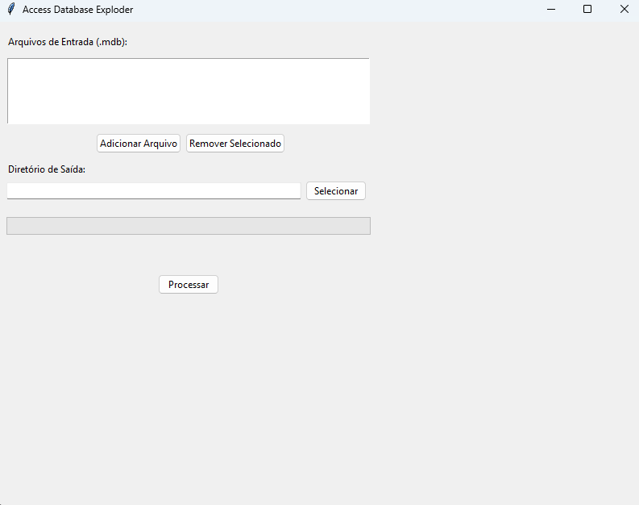

# Access Database Exploder

Uma ferramenta com interface gráfica para processar e separar bancos de dados Access (.mdb), criando arquivos individuais para cada tabela que contenha dados.



## Funcionalidades

- Interface gráfica amigável usando Tkinter
- Processamento de até 2 arquivos .mdb simultaneamente
- Cria um novo arquivo .mdb para cada tabela com dados
- Mantém apenas registros não importados/temporários
- Barra de progresso e feedback visual do processamento
- Seleção flexível de diretório de saída

## Pré-requisitos

1. Python 3.8 ou superior
2. Driver Microsoft Access (necessário para manipulação dos arquivos .mdb)
   - Windows: "Microsoft Access Driver (*.mdb, *.accdb)"
   - Geralmente já vem instalado no Windows
   - Para outros sistemas operacionais, pode ser necessário usar soluções alternativas como MDBTools

## Instalação

1. Clone o repositório:
```bash
git clone https://github.com/seu-usuario/access-database-exploder.git
cd access-database-exploder
```

2. Crie um ambiente virtual (recomendado):
```bash
python -m venv venv
```

3. Ative o ambiente virtual:
- Windows:
  ```bash
  .\venv\Scripts\activate
  ```
- Linux/macOS:
  ```bash
  source venv/bin/activate
  ```

4. Instale as dependências:
```bash
pip install -r requirements.txt
```

## Uso

1. Execute o programa:
```bash
python Acess_Explode_GUI.py
```

2. Na interface:
   - Clique em "Adicionar Arquivo" para selecionar até 2 arquivos .mdb
   - Use "Remover Selecionado" para remover arquivos da lista se necessário
   - Selecione o diretório de saída
   - Clique em "Processar"

3. O programa irá:
   - Criar um diretório "Exploded_[NomeDoArquivo]" para cada arquivo processado
   - Gerar arquivos .mdb separados para cada tabela com dados
   - Manter apenas os registros que atendam aos critérios:
     - Importado = 0
     - ImportadoRepetido = 0
     - Removido = 0
     - Temporario = 0

## Estrutura dos Arquivos de Saída

Para cada arquivo .mdb processado, o programa cria:
```
Diretório_Saída/
└── Exploded_NomeDoArquivo/
    ├── Tabela1.mdb
    ├── Tabela2.mdb
    └── TabelaN.mdb
```

Cada arquivo .mdb gerado:
- Contém apenas os dados da tabela específica
- Mantém a estrutura original do banco
- Preserva apenas os registros que atendem aos critérios de filtro

## Solução de Problemas

1. **Erro de Driver ODBC**
   - Verifique se o Driver do Access está instalado
   - No Windows: Verifique o "ODBC Data Source Administrator"

2. **Erro de Permissão**
   - Certifique-se de ter permissões de leitura no arquivo de entrada
   - Verifique as permissões de escrita no diretório de saída

3. **Arquivo Não Processado**
   - Verifique se o arquivo .mdb não está corrompido
   - Certifique-se de que o arquivo não está aberto em outro programa

## Contribuindo

1. Faça um Fork do projeto
2. Crie uma branch para sua feature (`git checkout -b feature/SuaFeature`)
3. Commit suas mudanças (`git commit -m 'Adiciona nova feature'`)
4. Push para a branch (`git push origin feature/SuaFeature`)
5. Abra um Pull Request

## Licença

Este projeto está sob a licença MIT - veja o arquivo [LICENSE](LICENSE) para detalhes.

## Autor

Matheus da Silva Castro

## Notas de Versão

### v1.0.0
- Interface gráfica inicial
- Processamento de arquivos .mdb
- Filtro de registros
- Geração de arquivos separados por tabela 
